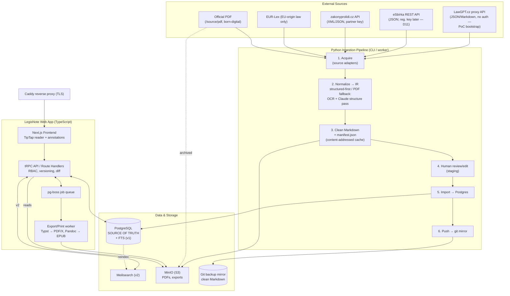
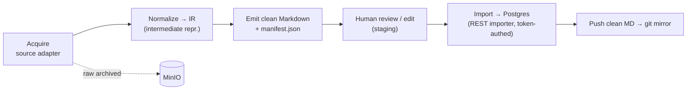
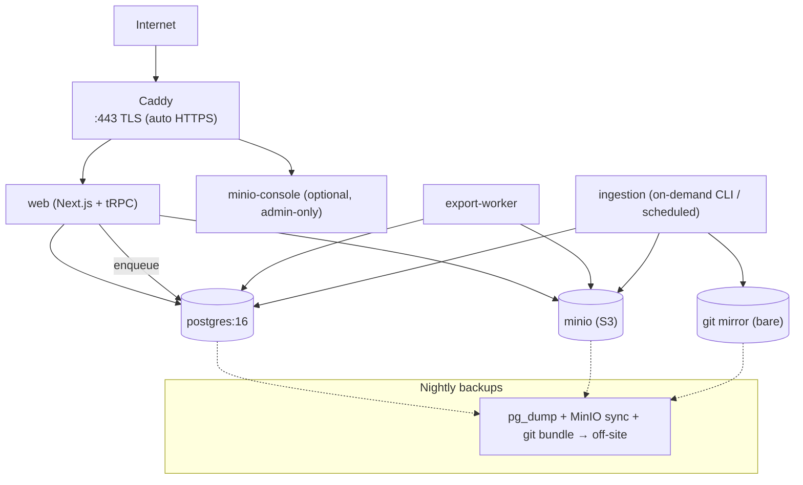

# LegisNote — System Architecture

> **Status:** Design v1 (2026-06-14)
> **Owner:** piech.zbynek@gmail.com
> **Scope:** Overall software architecture for the LegisNote web app + Python ingestion pipeline.
> **Companion docs:** [`requirements.md`](../requirements.md) (authoritative requirements), `docs/data-model.md` (database schema — produced separately; **this document does not duplicate the detailed schema**, it only references the entities it needs).

This document covers: component/service architecture, concrete tech choices, the ingestion pipeline, the export/print pipeline, repository layout, single-VPS deployment topology, and a phased build plan with risks.

---

## 0. Architectural principles (the "why" behind every choice)

These principles, derived from the requirements and decisions log, drive the rest of the design.

1. **PostgreSQL is the single source of truth** (D6). Git is a *downstream backup mirror* of clean Markdown, never read back by the app at runtime.
2. **Everything is independently addressable** (FR-2). Laws, parts, sections (§), sub-paragraphs, and even individual terms get stable IDs so tags/annotations/comments/links can attach anywhere and survive re-numbering across amendment snapshots (FR-10a).
3. **Pay conversion cost once** (FR-23, NFR-6). Ingestion is content-addressed and cached; the expensive OCR + Claude structure pass only runs on the PDF-fallback path and never re-runs for unchanged input.
4. **Structured-first, PDF-fallback** (D1). The pipeline is a set of pluggable *source adapters*; the rest of the pipeline is source-agnostic once it reaches a normalized intermediate representation.
5. **One language per concern.** TypeScript for the interactive app (D3); Python only where it is strongest (PDF/OCR/LLM). The two halves meet at a stable contract: **clean Markdown + a sidecar JSON manifest** (structure + amendment metadata).
6. **Self-hosted, boring, reproducible** (NFR-1, NFR-6). Everything runs as Docker Compose services on one VPS; no managed-cloud lock-in.
7. **Design for v2/v3 without building it.** The shared-canonical-only v1 (FR-7) is modeled so a per-user overlay can be added later by adding an `owner` dimension, not by reshaping tables.

---

## 1. Component / Service Architecture

### 1.1 Components

| # | Component | Tech | Responsibility |
|---|-----------|------|----------------|
| 1 | **Web frontend** | Next.js (React) + TipTap | Reading UI, inline annotation/tag/link/comment, diff viewer, study-highlight views, search UI, export triggers. |
| 2 | **Web backend / API** | Next.js Route Handlers + tRPC (Node) | Domain logic, auth/RBAC, annotation CRUD, versioning/diff, search orchestration, export job dispatch. |
| 3 | **PostgreSQL** | Postgres 16 + `unaccent` + Czech FTS config | **Source of truth.** Structured law model, annotations, versions, study highlights, users, FTS index (v1). See `docs/data-model.md`. |
| 4 | **Search** | Postgres FTS (v1) → Meilisearch (v2) | Full-text search across law text (and later annotations). |
| 5 | **Object storage** | MinIO (S3-compatible) | Source PDFs, OCR artifacts, generated export PDFs/EPUBs. Large binaries do **not** live in Postgres or git. |
| 6 | **Ingestion pipeline** | Python (Typer CLI + workers) | Source acquisition → normalize → clean Markdown + manifest → import to Postgres → push to git mirror. |
| 7 | **Export/print service** | Typst (print PDF) + Pandoc (EPUB) | Renders structured content to print-ready PDF/X and electronic formats. Runs as a worker invoked by the backend. |
| 8 | **Git backup mirror** | bare git repo on VPS (+ optional remote) | Versioned backup of clean Markdown + manifests (D6, FR-24). Write-only from the app's perspective. |
| 9 | **Reverse proxy** | Caddy | TLS termination (automatic HTTPS), routing to frontend/API/MinIO console. |
| 10 | **Job queue** | pg-boss (Postgres-backed) | Async jobs: ingestion import, export rendering, search reindex. No extra broker needed. |

> **Why pg-boss over Redis/BullMQ:** v1 is single-VPS and low-volume. A Postgres-backed queue removes an entire moving part (Redis) and keeps jobs transactional with the data they touch. Revisit if throughput demands it.

### 1.2 System diagram



### 1.3 Search recommendation: Postgres FTS now, Meilisearch later

**Recommendation: start with PostgreSQL full-text search; migrate the search read-path to Meilisearch in v2 when ranking/typo-tolerance matters (NFR-4).**

- **Postgres FTS (v1):** `tsvector` columns on section text with the Czech text-search config + `unaccent`, GIN-indexed. Zero new infra, transactional with the data, perfectly adequate for a corpus of tens-to-hundreds of laws. Handles "search within this law" and cross-law search.
- **Meilisearch (v2):** purpose-built, excellent **diacritics-insensitive + typo-tolerant** matching (a real win for Czech legal vocabulary), instant-search UX, faceting by law/test-tag. Postgres stays the source of truth; a reindex job (triggered on publish) pushes documents into Meilisearch. **OpenSearch is overkill** for a single-VPS deployment — heavy JVM footprint for no v1 benefit.

---

## 2. Concrete Tech Choices (opinionated)

### 2.1 Frontend — **Next.js (React) with App Router**

- **Why over SvelteKit:** the load-bearing component here is the **annotation editor**, and the richest, best-maintained structured-document editor ecosystem (ProseMirror/**TipTap**, `prosemirror-collab`, diff tooling) is React-first. Next.js also gives SSR for fast first-paint on long laws (NFR-4) and a clean path to public/SEO access in v3.
- Server Components for read-heavy law rendering; Client Components only for the interactive editor/annotation layer.

### 2.2 Rich-text / annotation editor — **TipTap (on ProseMirror)** + inline anchoring

The reading surface is **not a freeform editor**; it's a *structured, mostly-read-only document with an annotation overlay*. TipTap fits because ProseMirror's model is a typed node tree that maps directly to the Law → Part → § → sub-paragraph → letter hierarchy (FR-1).

**How inline annotation anchoring works:**

1. **Structural anchors (stable, primary).** Every structural unit renders with its **stable DB id** (`section_id`, `subparagraph_id`, …) as a node attribute / `data-anchor`. Tags/annotations/comments/links attaching to a *whole unit* (FR-3/4/5/6) reference that id directly. These survive amendment re-numbering because the id is stable across snapshots (FR-10a).
2. **Term/range anchors (within a unit).** For word- or span-level annotations (FR-3, FR-4) we store an anchor as `{ unit_id, start_offset, end_offset, quote }` — a **character offset range within a single structural unit's normalized text**, plus the literal quoted text as a self-healing fallback. Because text is consolidated-snapshot-immutable, offsets are stable within a snapshot; the `quote` lets us re-anchor (fuzzy match) if an annotation is carried forward to a newer snapshot where the surrounding text shifted.
3. **Rendering.** Annotations/highlights are a **decoration layer** (ProseMirror decorations), not edits to the document — so the canonical text is never mutated by annotating. Test/study highlights (FR-11) and personal highlights (FR-12) are just additional decoration sources keyed by the same anchor scheme.
4. **Links** (FR-6) are stored as `(source_anchor, target_anchor, type)` rows and rendered as decorations on the source side; "link everything through everything" is naturally an edge table over the anchor space.

> This keeps **content** (versioned, canonical) and **annotation overlay** (mutable, possibly per-user in v2) cleanly separated — the overlay is addressed by stable anchors, never embedded in the text.

### 2.3 Backend — **Next.js Route Handlers + tRPC**, Node runtime

- **API style: tRPC** (not REST/GraphQL). The frontend and backend are one TypeScript codebase with one consumer (the web app). tRPC gives **end-to-end type safety with zero schema-duplication or codegen** — the right call for a solo/small-team project. REST adds boilerplate; GraphQL adds a schema layer and caching complexity we don't need at this scale.
- Heavy/CPU-bound work (export rendering, ingestion import) is **not** done inline in request handlers — it's enqueued to pg-boss and run by workers.
- **ORM: Prisma** (or Drizzle) for the typed data layer; Prisma's migration tooling and the separately-produced `docs/data-model.md` schema are the contract.
- A thin **public REST endpoint** is exposed *only* for the Python ingestion importer (token-authed), so ingestion stays decoupled from tRPC internals.

### 2.4 Auth & roles — session-based, three roles

- **Auth: Auth.js (NextAuth)** with **database sessions** (Postgres adapter), credentials or email magic-link. Session cookies, not JWT-in-localStorage (safer, easy revocation). Invite-only in v1 (open question #12).
- **Roles (RBAC):** `Reader` → `Editor` (Law Administrator) → `Admin` (System Admin), checked in a tRPC middleware on every mutation. Mapping to requirements:
  - **Reader:** read laws, search, view shared annotations/highlights/diffs; (v2) own personal layer.
  - **Editor:** all Reader + import/clean laws, edit consolidated text, manage shared annotations and curated test-highlights (FR-11/D9), publish (FR-17), trigger exports.
  - **Admin:** all Editor + user management, deployment/ops concerns.
- **v1→v2 readiness:** annotation rows carry an `owner_id` (NULL = shared/canonical). v1 only writes shared rows via Editors (FR-7); v2 flips on per-user writes without a schema change.

### 2.5 Versioning & diff

- Consolidated-snapshot model (D5): a law has an ordered set of **snapshots** (effective date + amending-act reference metadata, FR-8). Each snapshot has its structural units; units carry **stable cross-snapshot ids** (FR-10a).
- **Diffs (FR-9/10)** computed per stable unit id between consecutive snapshots (word-level diff on normalized text), cached. The reader shows per-§ change indicators ("changed N times, last on DATE") and an "as of DATE" view. Detailed table shapes live in `docs/data-model.md`.

---

## 3. Ingestion Pipeline (Python)

A standalone Python app (Typer CLI, also runnable as a pg-boss-triggered worker). It produces the **contract artifact**: `clean.md` + `manifest.json`, then imports to Postgres and mirrors to git.

### 3.1 Stages



1. **Acquire (source adapters — structured-first, D1/FR-22).** Adapters in priority order (see `docs/research-czech-legislation-data.md`):
   - `LawGptAdapter` — **JSON/Markdown, no auth**; the immediate bootstrap source and the one used for the PoC (91/2012 Sb.).
   - `ESbirkaAdapter` — official **JSON** REST API, once the Ministry-of-Interior registration key arrives (D11).
   - `ZakonyProLidiAdapter` — XML/JSON, partner key (enrichment/fallback).
   - `EurLexAdapter` — FORMEX/AKN4EU XML, **EU-origin law only**.
   - `PdfAdapter` — born-digital PDF (no OCR for modern laws), last resort.
   - Each adapter returns the same **Intermediate Representation (IR)**: a typed tree of `{ unit_type, number, heading, text, children }` plus document-level amendment metadata (FR-26). Raw source is archived to MinIO. (Note: there is **no XML/Akoma Ntoso** for Czech national law — structured input is JSON/Markdown.)
2. **Normalize → IR.**
   - **Structured path:** deterministic JSON/Markdown → IR mapping (XML only for the EUR-Lex adapter). No LLM. Cheap, exact.
   - **PDF fallback path:** `PyMuPDF`/`pdfplumber` for text+layout; `ocrmypdf`/Tesseract only if the PDF is scanned/image-only; then a **Claude structure pass** (current Anthropic model — Claude Sonnet/Opus 4.x via the official `anthropic` Python SDK, user's own API key per D10) recovers hierarchy (§ boundaries, numbering, headings) and cleans OCR noise into the IR. The LLM is given page text + a strict JSON schema for the IR and asked to *structure*, not *rewrite*, the law text.
3. **Emit clean Markdown + manifest.** Markdown is the human/git-friendly form (NFR-5); `manifest.json` carries the structural tree with stable-id assignments and amendment metadata (the machine contract the importer consumes).
4. **Human review / edit (FR-16).** Output lands in a **staging area** (a draft snapshot in Postgres, or a reviewable Markdown file). An Editor reviews/cleans in the web app's editor (or directly in Markdown) before **publish** promotes it to a live consolidated snapshot. Nothing reaches Readers unreviewed.
5. **Import → Postgres** via the token-authed REST importer endpoint; assigns/links stable unit ids across snapshots.
6. **Push → git mirror** (D6/FR-24): commit `clean.md` + `manifest.json` to the bare repo. One-way, backup only.

### 3.2 Avoiding re-conversion (FR-23, NFR-6)

- **Content-addressed cache:** key = `sha256(raw source bytes) + adapter version + prompt/model version`. If a cache entry exists in MinIO, stages 2–3 are skipped entirely — the expensive OCR+Claude pass never re-runs for unchanged input or unchanged pipeline code.
- **Determinism:** structured path is fully deterministic. LLM path pins model id + prompt version in the cache key so a model upgrade is an explicit, auditable re-run, not an accidental one.
- **Idempotent import:** re-importing the same manifest is a no-op (matched by content hash + stable ids).

---

## 4. Export / Print Pipeline

Triggered from the web app (Editor action, FR-17/18/19/20) → enqueued to pg-boss → rendered by the export worker → artifact stored in MinIO → download link surfaced in UI.

### 4.1 Print-ready PDF — **Typst** (recommended) over LaTeX / HTML+Paged.js

- **Recommendation: Typst.** It produces high-quality, deterministic PDFs from a clean, programmable markup; far simpler templating than LaTeX, fast, single static binary (trivial to containerize), and excellent control over A5/B5 page geometry, running headers, ToC, and marginalia for annotations (open question #10). Source content (the structured snapshot) is rendered to Typst markup, then compiled to PDF.
- **PDF/X-1a (D4):** Typst targets PDF; for the **PDF/X-1a** color/compliance step required by EU printers (FR-19), post-process with **Ghostscript** (CMYK conversion + PDF/X-1a output intent). This two-step (Typst → Ghostscript) reliably yields a print-house-acceptable file. Refine bleed/ICC profile once an actual printer is chosen.
- **Why not HTML+Paged.js/WeasyPrint:** workable, but CSS Paged Media is fiddlier for precise book typography and PDF/X compliance than Typst+Ghostscript, and pulls a headless-browser dependency for Paged.js.

### 4.2 Electronic formats (FR-20, open question #11)

- **Primary:** the web reading experience itself.
- **EPUB (v2):** generate via **Pandoc** from the same structured content → good e-reader support.
- **Screen PDF:** the same Typst pipeline with a screen profile (RGB, no bleed) for a downloadable copy.

> Single source, multiple renderers: the structured snapshot in Postgres is the input to *all* export targets; templates differ, content does not.

---

## 5. Repository / Project Layout

**Recommendation: a single monorepo** with pnpm workspaces for the TS side and a self-contained Python package for ingestion. Rationale: one product, tightly-coupled contract (shared types + Markdown/manifest schema), atomic cross-cutting changes, one CI. The Python tool is isolated in its own directory with its own toolchain — a monorepo does not force a shared language.

```text
legisnote/
├─ apps/
│  └─ web/                     # Next.js app (frontend + tRPC API)
│     ├─ src/app/              #   App Router routes (reader, admin, search)
│     ├─ src/server/           #   tRPC routers, auth, RBAC, services
│     ├─ src/editor/           #   TipTap config, annotation decorations, anchoring
│     └─ prisma/               #   schema.prisma + migrations (see docs/data-model.md)
├─ services/
│  └─ export/                  # Typst + Pandoc + Ghostscript render worker
├─ tools/
│  └─ ingestion/               # Python ingestion app (separate toolchain)
│     ├─ legisnote_ingest/
│     │  ├─ adapters/          #   lawgpt.py, pdf.py, base.py (esbirka/eurlex later)
│     │  ├─ parse/             #   czech_statute.py (text -> IR; the deterministic core)
│     │  ├─ emit/              #   markdown + manifest writers (schema-validated)
│     │  ├─ importer/          #   POST to web importer
│     │  ├─ cache/             #   content-addressed cache (local; MinIO in prod)
│     │  ├─ ir.py              #   IR / manifest pydantic models
│     │  ├─ pipeline.py        #   acquire -> parse -> emit orchestration
│     │  └─ cli.py             #   Typer entrypoint
│     ├─ pyproject.toml
│     └─ tests/
├─ packages/
│  └─ shared/                  # Shared TS types + the manifest JSON schema
│     └─ schema/manifest.schema.json   # the cross-language contract
├─ source/                     # (existing) raw + clean law artifacts
│  ├─ pdf/                     #   official source PDFs (e.g. ZMPS_interaktiv.pdf)
│  └─ md/                      #   clean Markdown output
├─ docs/
│  ├─ architecture.md          # this document
│  ├─ data-model.md            # DB schema (produced separately)
│  └─ requirements.md → ../requirements.md
├─ infra/
│  ├─ docker-compose.yml
│  ├─ Caddyfile
│  └─ backups/                 # backup scripts (pg_dump, MinIO, git)
└─ pnpm-workspace.yaml
```

> The **manifest JSON schema** in `packages/shared/schema/` is the formal contract between Python (producer) and TS (consumer); both sides validate against it.

---

## 6. Deployment Topology (single VPS, Docker Compose)



**Compose services:** `caddy`, `web`, `export-worker`, `postgres`, `minio`, `ingestion` (run on demand / via cron), optional `meilisearch` (v2). Internal services bind to the Docker network only; **only Caddy is exposed** (:80/:443).

**Reverse proxy — Caddy** (over Traefik): dead-simple config, automatic Let's Encrypt TLS, fine for a single-host single-app deployment. Traefik's dynamic service discovery is unnecessary here.

**Secrets management** (Claude API key D10, future eSbírka key D11, DB/MinIO creds):
- Stored in a git-ignored `infra/.env` injected via Compose `env_file`/Docker secrets — **never** committed.
- The **user's Claude API key** is consumed only by the `ingestion` service. The **eSbírka key** (per-request, arriving later) is added to the same env later with no code change — the adapter reads it from env.
- Document a `.env.example` with placeholder keys; rotate by editing env + restart.

**Backups** (NFR-5):
- Nightly `pg_dump` (the source of truth) → MinIO + off-site copy.
- MinIO bucket sync to off-site (PDFs/exports).
- Git mirror is itself a backup of clean Markdown; periodically `git bundle` / push to a remote.
- This gives **3 independent recovery layers**: Postgres dump (full state), MinIO (binaries), git (clean content).

---

## 7. Phased Build Plan & Risks

### 7.1 Phases (mapped to v1/v2/v3)

**v1 — MVP (shared canonical repo)**
1. Infra skeleton: Compose (Caddy + Postgres + MinIO + web), auth + RBAC (3 roles), Prisma schema from `docs/data-model.md`.
2. Ingestion **structured path** end-to-end on the PoC law **91/2012 Sb.** (D7): `LawGptAdapter` (JSON/Markdown, no auth — immediately usable while the eSbírka registration is pending) → IR → clean Markdown + manifest → import → git mirror. Content-addressed cache. The `PdfAdapter` + Claude structure pass is built alongside as the fallback path but is **not** on the PoC critical path.
3. Reading UI: structured rendering + TipTap; **shared** tags/annotations/comments/links at all levels (FR-3/4/5/6); stable anchors.
4. Consolidated-snapshot versioning + per-§ diff viewer + "as of date" (FR-8/9/10).
5. **Postgres FTS** (Czech config + unaccent) — FR-21.
6. **Admin-curated test highlights** (FR-11/D9) + study-relevance filter (FR-13).
7. **Export:** Typst → Ghostscript print-ready PDF/X-1a (FR-18/19) + screen PDF (FR-20).

**v2**
- **Per-user personal annotation/tag/link layer** (flip on `owner_id`; FR-7/12).
- **Meilisearch** read-path (typo/diacritics tolerance), search over annotations.
- **eSbírka official JSON adapter** once the Ministry-of-Interior API key lands (D11) — promotes the official source above the LawGPT proxy.
- **EPUB export** (Pandoc).

**v3**
- Cross-law reference graph (links-as-edges already in place) and navigation.
- Public / multi-tenant access; richer real-time collaboration (`prosemirror-collab`).

### 7.2 Key risks & decisions

| Risk / open decision | Impact | Mitigation / recommendation |
|---|---|---|
| **PDF structure recovery quality** (Czech legal PDFs, OCR noise) | Bad structure → bad anchors/diffs | Mandatory **human review step** (FR-16) before publish; strict IR JSON schema for the LLM; structured-first once eSbírka arrives. |
| **Stable cross-snapshot unit ids** under re-numbering | Annotations/diffs break (FR-10a) | Match units across snapshots by content+heading heuristics at import; let Editors confirm/override mappings in review. |
| **Range-anchored annotations drifting** across snapshots | Lost personal/study highlights (v2) | Store `quote` fallback + fuzzy re-anchor; flag un-re-anchorable annotations for user attention. |
| **PDF/X-1a printer compliance** (printer not yet chosen) | Print job rejected | Typst→Ghostscript pipeline is parameterized (page size, bleed, ICC); finalize against the actual printer's spec (open Q#9/10). |
| **LLM cost/drift** (D10, user's key) | Surprise cost, non-reproducibility | Content-addressed cache keyed on model+prompt version; structured path uses no LLM; convert-once guarantee. |
| **Single-VPS resource limits** (NFR-4) | Slow search/render at scale | Start lean (Postgres FTS, pg-boss); Meilisearch and worker scaling are drop-in when needed. |
| **Open requirements** (#7 v1 annotation sharing, #11 e-format, #13 UI lang) | Scope creep | Schema already v2-ready (`owner_id`); export pipeline is multi-target; UI strings externalized for i18n from day one. |

---

## 8. The cross-language contract (summary)

The whole architecture hinges on one clean seam between the TypeScript app and the Python tool:

```
Python ingestion  ──►  clean.md + manifest.json  ──►  TS importer ──► Postgres (truth)
                                  │                                        │
                                  └────────────► git mirror (backup) ◄─────┘ (clean MD only)
```

`manifest.json` (validated against `packages/shared/schema/manifest.schema.json`) carries the structural tree, stable id assignments, and amendment metadata. Markdown is the human/git-friendly rendering. Postgres is the source of truth; git holds only clean Markdown as backup.
