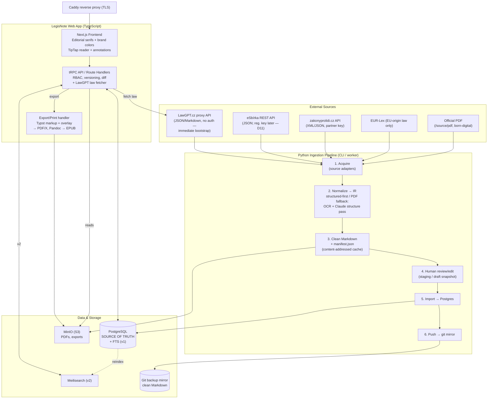
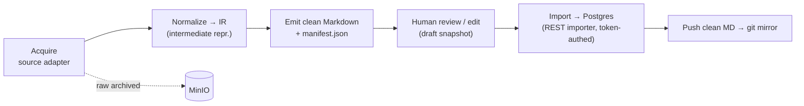
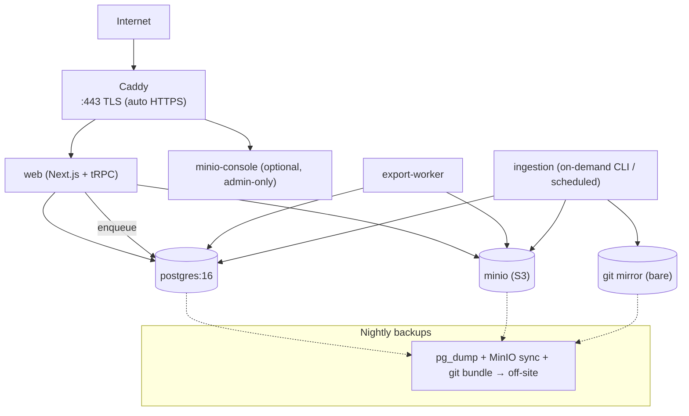

# LegisNote — System Architecture

> **Status:** Design v1.1 (2026-06-15, updated with LawGPT import, PDF export, visual design)
> **Owner:** piech.zbynek@gmail.com
> **Scope:** Overall software architecture for the LegisNote web app + Python ingestion pipeline.
> **Companion docs:** [`requirements.md`](../requirements.md) (requirements), `docs/data-model.md` (database schema), `docs/deployment.md` (how to run it).

This document covers: component/service architecture, concrete tech choices, the ingestion pipeline, the export/print pipeline, repository layout, single-VPS deployment topology, and recent feature additions (LawGPT integration, PDF export with annotations, visual design).

---

## 0. Architectural principles (the "why" behind every choice)

These principles, derived from the requirements and decisions log, drive the rest of the design.

1. **PostgreSQL is the single source of truth** (D6). Git is a *downstream backup mirror* of clean Markdown, never read back by the app at runtime.
2. **Everything is independently addressable** (FR-2). Laws, parts, sections (§), sub-paragraphs, and even individual terms get stable IDs so tags/annotations/comments/links can attach anywhere and survive re-numbering across amendment snapshots (FR-10a).
3. **Pay conversion cost once** (FR-23, NFR-6). Ingestion is content-addressed and cached; the expensive OCR + Claude structure pass only runs on the PDF-fallback path and never re-runs for unchanged input.
4. **Structured-first, PDF-fallback** (D1). The pipeline is a set of pluggable *source adapters*; the rest of the pipeline is source-agnostic once it reaches a normalized intermediate representation.
5. **One language per concern.** TypeScript for the interactive app (D3); Python only where it is strongest (PDF/OCR/LLM). The two halves meet at a stable contract: **clean Markdown + a sidecar JSON manifest** (structure + amendment metadata).
6. **Self-hosted, boring, reproducible** (NFR-1, NFR-6). Everything runs as Docker Compose services on one VPS; no managed-cloud lock-in.
7. **Design for v2/v3 without building it.** The shared-canonical-only v1 (FR-7) is modeled so a per-user overlay can be added later by adding an `owner` dimension, not by reshaping tables.
8. **Overlay over content.** User annotations (tags, notes, highlights, links) are a separate layer anchored to stable structural nodes, never embedded in the law text itself. This keeps the canonical text clean and amendments simple.

---

## 1. Component / Service Architecture

### 1.1 Components

| # | Component | Tech | Responsibility |
|---|-----------|------|----------------|
| 1 | **Web frontend** | Next.js (React) + TipTap + editorial serifs | Reading UI, inline annotation/tag/link/comment, diff viewer, study-highlight views, search UI, export triggers. Visual design: aubergine (#401E5C) + gold (#DCA712) palette. |
| 2 | **Web backend / API** | Next.js Route Handlers + tRPC (Node) | Domain logic, auth/RBAC, annotation CRUD, versioning/diff, search orchestration, export job dispatch, LawGPT law fetching. |
| 3 | **PostgreSQL** | Postgres 16 + `unaccent` + Czech FTS config | **Source of truth.** Structured law model, annotations, versions, study highlights, users, FTS index (v1). See `docs/data-model.md`. |
| 4 | **Search** | Postgres FTS (v1) → Meilisearch (v2) | Full-text search across law text (and later annotations). |
| 5 | **Object storage** | MinIO (S3-compatible) | Source PDFs, OCR artifacts, generated export PDFs/EPUBs. Large binaries do **not** live in Postgres or git. |
| 6 | **Ingestion pipeline** | Python (Typer CLI + workers) | Source acquisition → normalize → clean Markdown + manifest → import to Postgres → push to git mirror. |
| 7 | **Export/print service** | Typst (print PDF) + Pandoc (EPUB) | Renders structured content + overlay (annotations/highlights/tags/exam notes) to print-ready PDF/X and electronic formats. Runs as inline handler (currently) or worker. |
| 8 | **Git backup mirror** | bare git repo on VPS (+ optional remote) | Versioned backup of clean Markdown + manifests (D6, FR-24). Write-only from the app's perspective. |
| 9 | **Reverse proxy** | Caddy | TLS termination (automatic HTTPS), routing to frontend/API/MinIO console. |
| 10 | **Job queue** | pg-boss (Postgres-backed) | Async jobs: ingestion import, export rendering, search reindex. No extra broker needed. |

> **Why pg-boss over Redis/BullMQ:** v1 is single-VPS and low-volume. A Postgres-backed queue removes an entire moving part (Redis) and keeps jobs transactional with the data they touch. Revisit if throughput demands it.

### 1.2 System diagram



### 1.3 Recent additions: LawGPT integration + PDF export with overlay

**LawGPT law fetching (FR-22 update):**
- `/import` page offers a citation field + quick-picks (89/2012, 40/2009, etc.)
- Backend procedure `editorial.importFromLawGpt({number, year})` fetches from LawGPT.cz, parses via TS Czech-statute parser, and imports as a draft snapshot
- Includes one-shot network retry for cold-start blips
- TS parser (`server/import/czechStatute.ts`) is a faithful port of the Python parser so both paths produce identical unit trees

**PDF export with overlay (FR-18/19/20 enhancement):**
- Law export route now assembles annotations (tags, notes, comments), highlights (with quoted text), and — when `?exam=<id>` — exam relevance per provision
- Typst markup generation includes a `annblock` function that renders a gold-ruled annotation block under each § with all overlay data
- New route `/api/export/exam/[id]` renders an exam's condensed highlight summary as a standalone A5 booklet
- Both law and exam exports support screen (RGB) and print (CMYK/PDF/X-1a via Ghostscript) formats

**Visual design (illuminated legal review):**
- Global `SiteHeader` component (logo + wordmark + nav + compact auth)
- `globals.css` brand palette: aubergine (#401E5C) plum ink, gold (#DCA712) leaf accents, warm paper background (#faf5ea) with subtle radial atmosphere
- Editorial serifs via next/font/google: **Fraunces** (display, headings) + **Newsreader** (body, statute text), both with `latin-ext` so Czech diacritics render everywhere
- Refined buttons (pill-shaped, plum→gold hover), inputs (gold focus rings), cards (soft shadows), `.panelbar` surface (left gold rule)
- Reader § and part headings styled in brand colors; exam-relevance pills and highlights in brand palette

---

## 2. Concrete Tech Choices (opinionated)

### 2.1 Frontend — **Next.js (React) with App Router** + **Editorial Serifs**

- **Why over SvelteKit:** the load-bearing component here is the **annotation editor**, and the richest, best-maintained structured-document editor ecosystem (ProseMirror/**TipTap**, `prosemirror-collab`, diff tooling) is React-first. Next.js also gives SSR for fast first-paint on long laws (NFR-4) and a clean path to public/SEO access in v3.
- **Typography:** Fraunces (display) + Newsreader (body), self-hosted via next/font with `latin-ext`, guarantee diacritics in all headings and ensure the law text itself is readable and distinctive.
- Server Components for read-heavy law rendering; Client Components only for the interactive editor/annotation layer.

### 2.2 Rich-text / annotation editor — **TipTap (on ProseMirror)** + inline anchoring

The reading surface is **not a freeform editor**; it's a *structured, mostly-read-only document with an annotation overlay*. TipTap fits because ProseMirror's model is a typed node tree that maps directly to the Law → Part → § → sub-paragraph → letter hierarchy (FR-1).

**How inline annotation anchoring works:**

1. **Structural anchors (stable, primary).** Every structural unit renders with its **stable DB id** (`node_id`) as a node attribute / `data-anchor`. Tags/annotations/comments/links attaching to a *whole unit* (FR-3/4/5/6) reference that id directly. These survive amendment re-numbering because the id is stable across snapshots (FR-10a).
2. **Term/range anchors (within a unit).** For word- or span-level annotations (FR-3, FR-4) we store an anchor as `{ node_id, start_offset, end_offset, quote }` — a **character offset range within a single structural unit's normalized text**, plus the literal quoted text as a self-healing fallback. Because text is consolidated-snapshot-immutable, offsets are stable within a snapshot; the `quote` lets us re-anchor (fuzzy match) if an annotation is carried forward to a newer snapshot where the surrounding text shifted.
3. **Rendering.** Annotations/highlights are a **decoration layer** (ProseMirror decorations), not edits to the document — so the canonical text is never mutated by annotating. Test/study highlights (FR-11) and personal highlights (FR-12) are just additional decoration sources keyed by the same anchor scheme.
4. **Links** (FR-6) are stored as `(source_anchor, target_anchor, type)` rows and rendered as decorations on the source side; "link everything through everything" is naturally an edge table over the anchor space.

> This keeps **content** (versioned, canonical) and **annotation overlay** (mutable, possibly per-user in v2) cleanly separated — the overlay is addressed by stable anchors, never embedded in the text.

### 2.3 Backend — **Next.js Route Handlers + tRPC**, Node runtime

- **API style: tRPC** (not REST/GraphQL). The frontend and backend are one TypeScript codebase with one consumer (the web app). tRPC gives **end-to-end type safety with zero schema-duplication or codegen** — the right call for a solo/small-team project. REST adds boilerplate; GraphQL adds a schema layer and caching complexity we don't need at this scale.
- Heavy/CPU-bound work (export rendering, ingestion import) is **not** done inline in request handlers — it's enqueued to pg-boss and run by workers.
- **ORM: Prisma** (or Drizzle) for the typed data layer; Prisma's migration tooling and the separately-produced `docs/data-model.md` schema are the contract.
- A thin **public REST endpoint** is exposed *only* for the Python ingestion importer (token-authed), so ingestion stays decoupled from tRPC internals.

### 2.4 Auth & roles — session-based, three roles

- **Auth: Auth.js (NextAuth)** with **database sessions** (Postgres adapter), credentials or email magic-link. Session cookies, not JWT-in-localStorage (safer, easy revocation). Invite-only in v1 (open question #12).
- **Roles (RBAC):** `Reader` → `Editor` (Law Administrator) → `Admin` (System Admin), checked in a tRPC middleware on every mutation. Mapping to requirements:
  - **Reader:** read laws, search, view shared annotations/highlights/diffs; (v2) own personal layer.
  - **Editor:** all Reader + import/clean laws, edit consolidated text, manage shared annotations and curated test-highlights (FR-11/D9), publish (FR-17), trigger exports.
  - **Admin:** all Editor + user management, deployment/ops concerns.
- **v1→v2 readiness:** annotation rows carry an `owner_id` (NULL = shared/canonical). v1 only writes shared rows via Editors (FR-7); v2 flips on per-user writes without a schema change.

### 2.5 Versioning & diff

- Consolidated-snapshot model (D5): a law has an ordered set of **snapshots** (effective date + amending-act reference metadata, FR-8). Each snapshot has its structural units; units carry **stable cross-snapshot ids** (FR-10a).
- **Diffs (FR-9/10)** computed per stable unit id between consecutive snapshots (word-level diff on normalized text), cached. The reader shows per-§ change indicators ("changed N times, last on DATE") and an "as of DATE" view. Detailed table shapes live in `docs/data-model.md`.

### 2.6 Export pipeline — **Typst + Ghostscript**, with overlay rendering

- **Typst markup generation** (`server/export/typst.ts`):
  - `buildTypst(doc, annotations, examName?)` renders the law's structural tree + overlay (tags, notes, comments, highlights, exam relevance) to Typst markup
  - Overlay appears as a gold-ruled annotation block beneath each § with all attached data
  - Typst is evaluated at compile time, so the markup is safe (no injection risk)
- **PDF formats:**
  - **Screen:** RGB, optimized for on-screen reading (no bleed, web colors)
  - **Print:** CMYK/PDF/X-1a via Ghostscript postprocessing (embed fonts, high-res, prepress profile)
- **Exam summary PDF** (`buildExamTypst(detail)`):
  - Renders the condensed highlight summary from `/exams/[id]` as a standalone A5 booklet
  - Title page + per-law sections with flagged provisions
  - Same dual-format (screen/print) option

---

## 3. Ingestion Pipeline (Python)

A standalone Python app (Typer CLI, also runnable as a pg-boss-triggered worker). It produces the **contract artifact**: `clean.md` + `manifest.json`, then imports to Postgres and mirrors to git.

### 3.1 Stages



1. **Acquire (source adapters — structured-first, D1/FR-22).** Adapters in priority order (see `docs/research-czech-legislation-data.md`):
   - `LawGptAdapter` — **JSON/Markdown, no auth**; the immediate bootstrap source and the one used for the PoC (91/2012 Sb.). Also used for web-based LawGPT import via the TypeScript port of the parser.
   - `ESbirkaAdapter` — official **JSON** REST API, once the Ministry-of-Interior registration key arrives (D11).
   - `ZakonyProLidiAdapter` — XML/JSON, partner key (enrichment/fallback).
   - `EurLexAdapter` — FORMEX/AKN4EU XML, **EU-origin law only**.
   - `PdfAdapter` — born-digital PDF (no OCR for modern laws), last resort.
   - Each adapter returns the same **Intermediate Representation (IR)**: a typed tree of `{ unit_type, number, heading, text, children }` plus document-level amendment metadata (FR-26). Raw source is archived to MinIO. (Note: there is **no XML/Akoma Ntoso** for Czech national law — structured input is JSON/Markdown.)

2. **Normalize → IR.**
   - **Structured path:** deterministic JSON/Markdown → IR mapping (XML only for the EUR-Lex adapter). No LLM. Cheap, exact.
   - **PDF fallback path:** `PyMuPDF`/`pdfplumber` for text+layout; `ocrmypdf`/Tesseract only if the PDF is scanned/image-only; then a **Claude structure pass** (current Anthropic model — Claude Sonnet/Opus 4.x via the official `anthropic` Python SDK, user's own API key per D10) recovers hierarchy (§ boundaries, numbering, headings) and cleans OCR noise into the IR. The LLM is given page text + a strict JSON schema for the IR and asked to *structure*, not *rewrite*, the law text.

3. **Emit clean Markdown + manifest.** Markdown is the human/git-friendly form (NFR-5); `manifest.json` carries the structural tree with stable-id assignments and amendment metadata (the machine contract the importer consumes).

4. **Human review / edit (FR-16).** Output lands in a **draft snapshot** in Postgres (or a reviewable Markdown file). An Editor reviews/cleans in the web app's editor (or directly in Markdown) before **publish** promotes it to a live consolidated snapshot. Nothing reaches Readers unreviewed.

5. **Import → Postgres** via the token-authed REST importer endpoint; assigns/links stable unit ids across snapshots.

6. **Push → git mirror** (D6/FR-24): commit `clean.md` + `manifest.json` to the bare repo. One-way, backup only.

### 3.2 Avoiding re-conversion (FR-23, NFR-6)

- **Content-addressed cache:** key = `sha256(raw source bytes) + adapter version + prompt/model version`. If a cache entry exists in MinIO, stages 2–3 are skipped entirely — the expensive OCR+Claude pass never re-runs for unchanged input or unchanged pipeline code.
- **Determinism:** structured path is fully deterministic. LLM path pins model id + prompt version in the cache key so a model upgrade is an explicit, auditable re-run, not an accidental one.
- **Idempotent import:** re-importing the same manifest is a no-op (matched by content hash + stable ids).

---

## 4. Repository / Project Layout

**Recommendation: a single monorepo** with pnpm workspaces for the TS side and a self-contained Python package for ingestion. Rationale: one product, tightly-coupled contract (shared types + Markdown/manifest schema), atomic cross-cutting changes, one CI. The Python tool is isolated in its own directory with its own toolchain — a monorepo does not force a shared language.

```text
legisnote/
├─ apps/
│  └─ web/                     # Next.js app (frontend + tRPC API)
│     ├─ src/app/              #   App Router routes (reader, admin, search, import, edit)
│     ├─ src/server/           #   tRPC routers, auth, RBAC, services
│     ├─ src/components/        #   Reusable React components (SiteHeader, etc.)
│     ├─ src/reader/           #   Reader UI, TipTap config, annotation overlays
│     ├─ src/public/           #   Static assets (logo.svg)
│     └─ prisma/               #   schema.prisma + migrations (see docs/data-model.md)
├─ services/
│  └─ export/                  # (v2) Typst + Pandoc + Ghostscript render worker
├─ tools/
│  └─ ingestion/               # Python ingestion app (separate toolchain)
│     ├─ legisnote_ingest/
│     │  ├─ adapters/          #   lawgpt.py, pdf.py, base.py (esbirka/eurlex later)
│     │  ├─ parse/             #   czech_statute.py (text -> IR; the deterministic core)
│     │  ├─ emit/              #   markdown + manifest writers (schema-validated)
│     │  ├─ importer/          #   POST to web importer
│     │  ├─ cache/             #   content-addressed cache (local; MinIO in prod)
│     │  ├─ mirror.py          #   Git backup of clean Markdown
│     │  ├─ ir.py              #   IR / manifest pydantic models
│     │  ├─ pipeline.py        #   acquire -> parse -> emit orchestration
│     │  └─ cli.py             #   Typer entrypoint
│     ├─ pyproject.toml
│     └─ tests/
├─ packages/
│  └─ shared/                  # Shared TS types + the manifest JSON schema
│     ├─ schema/manifest.schema.json   # the cross-language contract
│     └─ src/index.ts          # Shared TS types & enums
├─ source/                     # (existing) raw + clean law artifacts
│  ├─ pdf/                     #   official source PDFs (e.g. ZMPS_interaktiv.pdf)
│  ├─ md/                      #   clean Markdown output
│  └─ manifest/                #   manifest.json per law
├─ docs/
│  ├─ architecture.md          # this document
│  ├─ data-model.md            # DB schema (produced separately)
│  ├─ deployment.md            # Local + VPS runbooks
│  └─ research-czech-legislation-data.md  # Law data sources
├─ infra/
│  ├─ docker-compose.yml       # Production Compose
│  ├─ docker-compose.local.yml # Zero-config local dev stack
│  ├─ local-up.sh              # Bootstrap script for local
│  ├─ local.env                # Dev defaults (committed)
│  ├─ .env.example             # Prod env template (git-ignored)
│  ├─ Caddyfile                # Reverse proxy config
│  ├─ db/                      # Schema + migrations
│  │  ├─ schema.sql            #   Full DDL (init-only)
│  │  └─ migrations/           #   Hand-written migrations (001_publish_gate.sql, etc.)
│  └─ backups/                 # Backup scripts (pg_dump, MinIO, git)
├─ img/                        # Logo and visual assets
├─ pnpm-workspace.yaml
├─ README.md                   # User-facing guide (beginner-friendly)
└─ requirements.md             # Authoritative feature list + decision log
```

> The **manifest JSON schema** in `packages/shared/schema/` is the formal contract between Python (producer) and TS (consumer); both sides validate against it. The **Czech statute parser** is mirrored in both tools (`tools/ingestion/parse/czech_statute.py` and `apps/web/src/server/import/czechStatute.ts`) so they must stay in sync as laws are added.

---

## 5. Deployment Topology (single VPS, Docker Compose)



**Compose services:** `caddy`, `web`, `postgres`, `minio`, optional `export-worker` (v2), optional `meilisearch` (v2). Internal services bind to the Docker network only; **only Caddy is exposed** (:80/:443).

**Local development stack** (`docker-compose.local.yml`): Postgres + web, bound to `127.0.0.1:3000`, zero-config with dev defaults. Bootstrap via `infra/local-up.sh` (one command).

**Reverse proxy — Caddy** (over Traefik): dead-simple config, automatic Let's Encrypt TLS, fine for a single-host single-app deployment. Traefik's dynamic service discovery is unnecessary here.

**Secrets management** (Claude API key D10, future eSbírka key D11, DB/MinIO creds):
- Prod: stored in git-ignored `infra/.env` injected via Compose `env_file`/Docker secrets — **never** committed.
- Local: `infra/local.env` holds safe dev defaults and is committed (no production secrets).
- The **user's Claude API key** is consumed only by the `ingestion` service. The **eSbírka key** (per-request, arriving later) is added to the same env later with no code change — the adapter reads it from env.
- Document a `.env.example` with placeholder keys; rotate by editing env + restart.

**Backups** (NFR-5):
- Nightly `pg_dump` (the source of truth) → MinIO + off-site copy.
- MinIO bucket sync to off-site (PDFs/exports).
- Git mirror is itself a backup of clean Markdown; periodically `git bundle` / push to a remote.
- This gives **3 independent recovery layers**: Postgres dump (full state), MinIO (binaries), git (clean content).

---

## 6. Key Recent Changes (v1.1)

**LawGPT web import:**
- New `/import` page with citation field + quick-picks
- `editorial.importFromLawGpt` tRPC procedure fetches + parses + imports as draft
- Czech statute parser ported to TypeScript (`server/import/czechStatute.ts`) — must stay in sync with Python version
- One-shot network retry for cold-start blips

**PDF export enhancements:**
- Law PDF now carries the full overlay: tags, notes, comments, highlights (with quoted passages), and exam relevance
- New `/api/export/exam/[id]` route renders exam summaries as standalone A5 booklets
- Both routes support screen (RGB) and print (CMYK/PDF/X-1a) formats via Typst + Ghostscript
- Shared `server/export/render.ts` helper de-duplicates the compilation pipeline

**Visual design — "illuminated legal review":**
- Global SiteHeader (logo + wordmark + nav)
- Brand palette: aubergine plum (#401E5C) ink, gold leaf (#DCA712) accents, warm paper (#faf5ea)
- Editorial serifs (Fraunces + Newsreader) with `latin-ext` for Czech diacritics everywhere
- Refined components: pill buttons (plum→gold), gold-focus inputs, `.panelbar` surfaces, `.rule` dividers
- Reader styling: gold § labels, plum part headings with gold flourish

---

## 7. Risks & Decisions

| Risk / open decision | Impact | Mitigation / recommendation |
|---|---|---|
| **Czech statute parser sync** (Python ↔ TS) | Parser divergence → different unit trees | Keep both in `sync` notes in code; tests cross-validate (same law, both versions produce 507 units). |
| **LawGPT API availability** | Importer fails silently (cold-start retry). | Retry + clear error messages; escalate to eSbírka API once registered. |
| **PDF structure recovery quality** (Czech legal PDFs, OCR noise) | Bad structure → bad anchors/diffs | Mandatory **human review step** (FR-16) before publish; strict IR JSON schema for the LLM; structured-first once eSbírka arrives. |
| **Stable cross-snapshot unit ids** under re-numbering | Annotations/diffs break (FR-10a) | Match units across snapshots by content+heading heuristics at import; let Editors confirm/override mappings in review. |
| **Range-anchored annotations drifting** across snapshots | Lost personal/study highlights (v2) | Store `quote` fallback + fuzzy re-anchor; flag un-re-anchorable annotations for user attention. |
| **PDF/X-1a printer compliance** (printer not yet chosen) | Print job rejected | Typst→Ghostscript pipeline is parameterized (page size, bleed, ICC); finalize against the actual printer's spec (open Q#10). |
| **LLM cost/drift** (D10, user's key) | Surprise cost, non-reproducibility | Content-addressed cache keyed on model+prompt version; structured path uses no LLM; convert-once guarantee. |
| **Single-VPS resource limits** (NFR-4) | Slow search/render at scale | Start lean (Postgres FTS, pg-boss); Meilisearch and worker scaling are drop-in when needed. |

---

## 8. Summary

LegisNote is built on a clean separation: **structured law + versioning + stable identity** in the database, **overlay annotations** via web UI, **converters** (Python ingestion, TypeScript parsing, Typst export) at the seams. The frontend is designed for editorial elegance and clarity. The whole system favors boring, reproducible infrastructure (Docker Compose, Postgres, git) over managed clouds, so anyone can self-host it.
