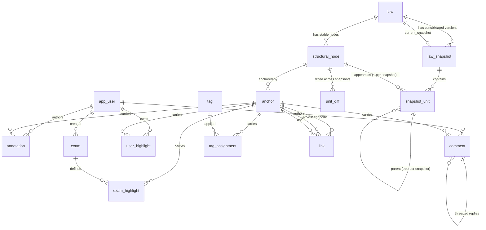

# LegisNote — Data Model

> Status: Draft v1 (2026-06-14) — PostgreSQL schema design, versioning-focused.
> Authoritative requirements: `../requirements.md`. Key decisions referenced as D1–D11, FR-1…FR-26.
> Stack: TypeScript web app + **PostgreSQL** (live source of truth, D6). Git holds clean Markdown as backup only.

This document is opinionated and implementation-ready. It picks a recommended approach for each design axis and notes the main alternative with trade-offs. SQL is DDL-sketch level (PostgreSQL 16).

---

## 1. Design goals & principles

1. **Everything addressable** (FR-2). Every structural unit — law, part, §, odstavec, písmeno, and even an arbitrary span of text — has a stable, referenceable identity so annotations, tags, comments, and links can attach anywhere.
2. **Consolidated snapshots only** (D5). Versioning = an ordered sequence of full consolidated snapshots per law. We never reconstruct amending acts; we only store "the whole law as it read on date X".
3. **Stable paragraph identity across snapshots** (FR-10a) is the hard core. A § must keep one logical identity even when it is renumbered, moved, or its text is amended, so diffs and annotations survive.
4. **Per-user is a clean v2 extension** (FR-7). v1 ships a single shared/canonical annotation layer; the schema carries an `owner_*` / `scope` seam so personal layers drop in without migration of the shared data.
5. **Czech-aware full-text search** (FR-21, NFR-3) via Postgres `tsvector` + a Czech config + `unaccent`.
6. **JSONB for flexible payloads, columns for things we query/join/index on.** Identity, ordering, dates, and foreign keys are real columns; rich annotation bodies and parser metadata are JSONB.

Conventions: all PKs are `uuid` (`gen_random_uuid()` via `pgcrypto`). `created_at`/`updated_at timestamptz` on mutable tables. Soft-delete only where audit matters; otherwise hard delete with `ON DELETE CASCADE`.

---

## 2. The versioning model (the focus)

### 2.1 Core concept: two layers — logical identity vs. snapshot content

The crux of the whole model is separating **what a unit *is*** from **what a unit *said* at a point in time**.

- **`structural_node`** — the *logical*, snapshot-independent identity of a structural unit (a particular § of a particular law, a particular odstavec, etc.). This is the **stable identity** that anchors everything (FR-10a). It is *not* versioned; it persists across all snapshots. It does **not** store text or numbering — those change over time.
- **`snapshot_unit`** — the *content* of one logical node *as it appears in one consolidated snapshot*: its text, its label/number (`§ 5`, `a)`, `Část druhá`), its position/ordering, and its parent **within that snapshot**. This is versioned: one row per (node, snapshot) where the node exists.

A **`law_snapshot`** is one consolidated version of a whole law, carrying `effective_from`, optional `effective_to`, and amending-act metadata (D5, FR-8). The set of `snapshot_unit` rows for a snapshot is the full text of the law as of that date.

```
law ─< law_snapshot (consolidated versions, ordered by effective_from)
law ─< structural_node (stable logical identities, snapshot-independent)
(law_snapshot × structural_node) ─ snapshot_unit (text + numbering + position per version)
```

This split is what makes everything else work:
- Renumbering changes `snapshot_unit.label` / `position` but the `structural_node.id` is unchanged → diffs and annotations follow the node, not the number.
- "Law as of date X" = pick the `law_snapshot` whose `[effective_from, effective_to)` contains X, then read its `snapshot_unit` tree.
- "How many times did this § change / when" = count distinct `snapshot_unit` rows for that `structural_node` whose `text_hash` differs from the previous snapshot's (see §2.4).

### 2.2 Hierarchy: stored per snapshot, identity shared

Hierarchy is intentionally stored on `snapshot_unit` (a `parent_id` pointing at another `snapshot_unit`), **not** on `structural_node`. Reason: a unit's parent and ordering can change between consolidations (a § moved to a different Část; odstavce inserted). The *logical node* is stable; its *placement* is snapshot-scoped.

Each `snapshot_unit` carries:
- `node_id` → the stable identity.
- `parent_unit_id` → tree position within this snapshot (nullable for the law root unit).
- `node_type` (enum: `law`, `part`, `title`, `chapter`, `section` (§), `paragraph` (odstavec), `point` (písmeno), `sentence`, `span`) — denormalized from the node for fast filtering.
- `label` (the human number/marker: `§ 5`, `(2)`, `a)`) and `ordinal` (sortable position among siblings).
- `path` — a materialized `ltree` of `ordinal`s for cheap subtree/order queries within a snapshot.
- `text` (the unit's own text content, excluding children) + FTS columns.

> Why not `closure_table` or adjacency on the node? Because the tree itself is versioned. Adjacency-on-snapshot_unit + `ltree path` gives us ordered reads and subtree queries per snapshot without a separate closure table per version.

### 2.3 Stable paragraph identity across renumbering — **the chosen approach**

**Chosen: explicit logical node identity + an `node_key` carried in source Markdown, with parser-assisted carry-forward and admin override.**

How identity is assigned when ingesting a new consolidated snapshot:

1. The ingestion tool emits clean Markdown in which **each structural unit carries a stable key** in an HTML-comment / fenced attribute, e.g. `<!-- node: 91-2012/§5/odst2/pismc -->` or a frontmatter map. This key is the durable handle.
2. On import, for each unit in the new snapshot we resolve its `structural_node`:
   - If the `node_key` already exists for this law → reuse that `structural_node.id` (identity preserved across renumber/move, because the key is *semantic*, not positional).
   - If it's new → create a new `structural_node`.
3. Where the source does **not** provide a key (PDF-fallback path, D1), we run a **matcher** to carry identity forward from the previous snapshot:
   - Match candidates by (same `node_type`, same or similar `label`, high text similarity via `pg_trgm` / token overlap, and same parent-node identity).
   - Assign best matches the existing `node_id`; flag low-confidence matches for **admin review** before publish.
4. Admins can **merge/split/relink** nodes in the editor for edge cases (a § split into two, two merged into one). The `node_key` ↔ `node_id` mapping is editable; corrections are stored so re-imports stay stable.

`structural_node` therefore stores: `id`, `law_id`, `node_key` (unique per law, nullable until assigned), `node_type`, `first_seen_snapshot_id`, optional `superseded_by_node_id` (for documented splits/merges), `created_at`.

**Why this approach (trade-offs):**
- (+) Identity is **semantic and source-driven** when structured data exists (the eSbírka **JSON** API and the LawGPT.cz proxy expose paragraph-level fragment identifiers — D1/D11; note Czech law has **no XML/Akoma Ntoso** publication, see `docs/research-czech-legislation-data.md`), giving rock-solid carry-forward for the majority case.
- (+) Degrades gracefully to fuzzy matching + human review for the PDF path, instead of failing.
- (+) Decouples identity from numbering entirely → renumbering is a no-op for identity, which is exactly FR-10a.
- (−) Requires the ingestion contract to emit/maintain keys, and a matcher + review UI for the fallback path. That's real work, but it's the unavoidable cost of stable identity.
- (−) Splits/merges are inherently lossy (one-to-many identity); we model them explicitly with `superseded_by_node_id` rather than pretending they don't happen.

**Alternative considered: positional/path identity only** (identify a § by its hierarchical number/path, no separate node id).
- (+) Simplest; no keys, no matcher.
- (−) **Breaks on renumbering** — the central requirement. A § that becomes `§ 5a` or moves Část would lose its history and orphan every annotation. Rejected for the primary identity role, though we keep `path`/`label` as *secondary* signals for the matcher.

**Second alternative: content-hash identity** (identify by normalized text hash).
- (+) Stable across pure renumbering (number isn't hashed).
- (−) **Breaks on the exact event we must track** — an amendment changes the text, which changes the hash, which would create a "new" unit and lose continuity. Rejected as identity; but `text_hash` is reused as the **change-detection** signal (§2.4).

### 2.4 Diffs: computed on demand, cached when expensive

We **do not** materialize a diff per unit per snapshot eagerly. Instead:

- Each `snapshot_unit` stores `text_hash` (sha256 of normalized text). "Did this node change between snapshot N and N+1?" = compare `text_hash` for the same `node_id` across the two snapshots. This makes the per-paragraph "changed / unchanged / added / removed" indicator (FR-9, FR-10) a cheap set operation, no diffing needed for the indicator.
- The actual **text diff** (word/char-level, for display) is computed on demand in the app (TypeScript, e.g. `diff-match-patch`) and **cached** in a `unit_diff` table keyed by `(node_id, from_snapshot_id, to_snapshot_id)` with a JSONB diff payload. Cache is populated lazily on first view and invalidated if a snapshot is re-imported.
- "How many times did § X change" = `COUNT(DISTINCT text_hash)` − 1 over the node's snapshot_units in effective order, or a count of hash transitions. "When" = the `effective_from` of each snapshot where the hash changed.

This keeps storage lean (most paragraphs are unchanged across most amendments) while keeping the indicator instant.

### 2.5 Annotation anchoring across snapshots — **the chosen approach**

An annotation/tag/comment/link must survive amendments. Anchoring rule:

**Anchor to the stable `structural_node` (logical identity), not to a `snapshot_unit`.** Plus an optional **text-range sub-anchor** for sub-unit (word/term/span) targets, with a **fuzzy re-anchoring** fallback.

- **Unit-level anchors** (whole law, §, odstavec, písmeno): target = `structural_node.id`. Because the node is stable across renumbering, the annotation simply *follows the node* into every future snapshot automatically. No migration needed when a law is re-consolidated. The annotation also records `created_in_snapshot_id` so the UI can show "annotation predates current text" when the node's `text_hash` later changes.
- **Sub-unit anchors** (a term/word/span inside a §): target = `structural_node.id` **plus** an anchor record: `{quote, prefix, suffix, start_offset, end_offset}` (a W3C-Web-Annotation-style `TextQuoteSelector` + `TextPositionSelector`) stored in JSONB. When the node's text changes:
  - Try exact offset match → if the quoted text still matches, keep.
  - Else fuzzy re-anchor by searching `quote` (with `prefix`/`suffix` context) in the new text via `pg_trgm` similarity.
  - If confidence is low, mark the annotation `anchor_status = 'orphaned'` and surface it for review (still attached to the node, just flagged as possibly stale). We never silently drop annotations.

`anchor_status` enum: `ok`, `shifted` (re-anchored at new offsets), `orphaned` (needs review). Stored on the annotation/target row.

**Why this approach (trade-offs):**
- (+) Unit-level annotations (the common case) are **free to maintain** — they ride the stable node id with zero per-snapshot work.
- (+) Sub-unit annotations degrade gracefully and are auditable rather than lost.
- (−) Fuzzy re-anchoring is heuristic; some spans will need human confirmation. Acceptable, and the `orphaned` flag makes it honest.

**Alternative: snapshot-pinned anchors** (anchor to `snapshot_unit`).
- (+) Exact and unambiguous *for that snapshot*.
- (−) Annotation belongs to one version only; viewing a later snapshot shows nothing unless we copy/migrate anchors forward on every import — exactly the maintenance burden we want to avoid. Rejected. (We do keep `created_in_snapshot_id` for provenance, but it is not the anchor.)

---

## 3. Schema (DDL sketches)

### 3.1 Extensions & enums

```sql
CREATE EXTENSION IF NOT EXISTS pgcrypto;     -- gen_random_uuid()
CREATE EXTENSION IF NOT EXISTS pg_trgm;      -- fuzzy match / re-anchoring
CREATE EXTENSION IF NOT EXISTS unaccent;     -- diacritics-insensitive FTS
CREATE EXTENSION IF NOT EXISTS ltree;        -- ordered tree paths per snapshot

-- Czech FTS config built on the simple/snowball stemmer + unaccent.
-- (Created once; 'czech' snowball dictionary ships with Postgres.)
CREATE TEXT SEARCH CONFIGURATION cs_unaccent ( COPY = czech );
ALTER TEXT SEARCH CONFIGURATION cs_unaccent
  ALTER MAPPING FOR hword, hword_part, word
  WITH unaccent, czech_stem;

CREATE TYPE node_type      AS ENUM
  ('law','part','title','chapter','section','paragraph','point','sentence','span');
CREATE TYPE anchor_status  AS ENUM ('ok','shifted','orphaned');
CREATE TYPE target_kind    AS ENUM ('node','snapshot_unit','range','law');
CREATE TYPE annotation_scope AS ENUM ('shared','personal');   -- v1 uses 'shared'
CREATE TYPE user_role      AS ENUM ('reader','editor','admin');
CREATE TYPE link_kind      AS ENUM
  ('reference','cross_law','definition','related','amends','see_also','custom');
```

### 3.2 Users & roles

```sql
CREATE TABLE app_user (
  id            uuid PRIMARY KEY DEFAULT gen_random_uuid(),
  email         citext UNIQUE NOT NULL,
  display_name  text NOT NULL,
  password_hash text,                 -- or external auth ref
  role          user_role NOT NULL DEFAULT 'reader',
  anthropic_key_enc bytea,            -- D10: user's own Claude API key (encrypted), ingestion
  created_at    timestamptz NOT NULL DEFAULT now(),
  updated_at    timestamptz NOT NULL DEFAULT now()
);
```

### 3.3 Laws, snapshots, stable nodes, snapshot units

```sql
CREATE TABLE law (
  id            uuid PRIMARY KEY DEFAULT gen_random_uuid(),
  -- official identity, e.g. "91/2012" (D7 PoC)
  citation      text NOT NULL,         -- "91/2012 Sb."
  number        text NOT NULL,         -- "91"
  year          int  NOT NULL,         -- 2012
  title_cs      text NOT NULL,
  short_title   text,
  source_kind   text,                  -- 'esbirka_json' | 'lawgpt' | 'zakonyprolidi' | 'eurlex' | 'pdf' (D1)
  current_snapshot_id uuid,            -- FK set below; cached pointer to latest effective
  metadata      jsonb NOT NULL DEFAULT '{}',
  created_at    timestamptz NOT NULL DEFAULT now(),
  UNIQUE (number, year)
);

-- One consolidated version of a whole law (D5, FR-8).
CREATE TABLE law_snapshot (
  id              uuid PRIMARY KEY DEFAULT gen_random_uuid(),
  law_id          uuid NOT NULL REFERENCES law(id) ON DELETE CASCADE,
  seq             int  NOT NULL,        -- 1,2,3… ordering of consolidations
  effective_from  date NOT NULL,        -- when this consolidated text took effect
  effective_to    date,                 -- NULL = currently in force; set when superseded
  amending_act    text,                 -- e.g. "zákon č. 161/2024 Sb." (metadata only, D5)
  amending_meta   jsonb NOT NULL DEFAULT '{}',  -- promulgation date, source refs (FR-26)
  source_commit   text,                 -- git commit of the Markdown backup (D6)
  imported_at     timestamptz NOT NULL DEFAULT now(),
  UNIQUE (law_id, seq),
  UNIQUE (law_id, effective_from)
);
ALTER TABLE law
  ADD CONSTRAINT law_current_snapshot_fk
  FOREIGN KEY (current_snapshot_id) REFERENCES law_snapshot(id);

-- Stable, snapshot-independent logical identity of a structural unit (FR-10a).
CREATE TABLE structural_node (
  id            uuid PRIMARY KEY DEFAULT gen_random_uuid(),
  law_id        uuid NOT NULL REFERENCES law(id) ON DELETE CASCADE,
  node_type     node_type NOT NULL,
  node_key      text,                  -- semantic stable key from source / assigned
  first_seen_snapshot_id uuid REFERENCES law_snapshot(id),
  superseded_by_node_id  uuid REFERENCES structural_node(id), -- documented split/merge
  created_at    timestamptz NOT NULL DEFAULT now(),
  UNIQUE (law_id, node_key)
);

-- Content of one node within one snapshot (versioned text + numbering + position).
CREATE TABLE snapshot_unit (
  id              uuid PRIMARY KEY DEFAULT gen_random_uuid(),
  snapshot_id     uuid NOT NULL REFERENCES law_snapshot(id) ON DELETE CASCADE,
  node_id         uuid NOT NULL REFERENCES structural_node(id) ON DELETE CASCADE,
  parent_unit_id  uuid REFERENCES snapshot_unit(id) ON DELETE CASCADE, -- tree in THIS snapshot
  node_type       node_type NOT NULL,  -- denormalized for filtering
  label           text,                -- "§ 5", "(2)", "a)", "Část druhá"
  ordinal         int  NOT NULL,       -- sort order among siblings
  path            ltree NOT NULL,      -- materialized ordinal path within snapshot
  text            text,                -- own text (excludes children)
  text_hash       bytea,               -- sha256(normalized text) — change detection (§2.4)
  fts             tsvector,            -- generated, Czech config (see §3.7)
  metadata        jsonb NOT NULL DEFAULT '{}',
  UNIQUE (snapshot_id, node_id)        -- a node appears at most once per snapshot
);

CREATE INDEX ON snapshot_unit (snapshot_id);
CREATE INDEX ON snapshot_unit (node_id);
CREATE INDEX ON snapshot_unit (parent_unit_id);
CREATE INDEX ON snapshot_unit USING gist (path);
CREATE INDEX ON snapshot_unit USING gin  (fts);
CREATE INDEX ON snapshot_unit USING gin  (text gin_trgm_ops);  -- re-anchoring/fuzzy
CREATE INDEX ON structural_node (law_id, node_type);
CREATE INDEX ON law_snapshot (law_id, effective_from);
```

**Reading "law as of date D":**
```sql
-- 1) pick the snapshot in force on D
SELECT * FROM law_snapshot
 WHERE law_id = $1 AND effective_from <= $2
   AND (effective_to IS NULL OR effective_to > $2)
 ORDER BY effective_from DESC LIMIT 1;
-- 2) read its tree, ordered
SELECT * FROM snapshot_unit
 WHERE snapshot_id = $snap ORDER BY path;
```

### 3.4 Diff cache

```sql
CREATE TABLE unit_diff (
  node_id          uuid NOT NULL REFERENCES structural_node(id) ON DELETE CASCADE,
  from_snapshot_id uuid NOT NULL REFERENCES law_snapshot(id) ON DELETE CASCADE,
  to_snapshot_id   uuid NOT NULL REFERENCES law_snapshot(id) ON DELETE CASCADE,
  change_type      text NOT NULL,       -- 'added'|'removed'|'modified'|'unchanged'
  diff             jsonb,               -- word/char diff payload, lazily computed
  computed_at      timestamptz NOT NULL DEFAULT now(),
  PRIMARY KEY (node_id, from_snapshot_id, to_snapshot_id)
);
```
The per-paragraph change indicator (FR-9/10) is derived from `text_hash` comparison without needing this table; `unit_diff` only caches the *rendered* diff.

### 3.5 Annotations, tags, comments (anchored to stable nodes — §2.5)

```sql
-- Generic anchor: points at a stable node, optionally a sub-range within it.
CREATE TABLE anchor (
  id            uuid PRIMARY KEY DEFAULT gen_random_uuid(),
  law_id        uuid NOT NULL REFERENCES law(id) ON DELETE CASCADE,
  node_id       uuid NOT NULL REFERENCES structural_node(id) ON DELETE CASCADE,
  -- sub-unit range selector (W3C-style), NULL for whole-unit anchors:
  selector      jsonb,                 -- {quote, prefix, suffix, start, end}
  created_in_snapshot_id uuid REFERENCES law_snapshot(id),
  anchor_status anchor_status NOT NULL DEFAULT 'ok',
  created_at    timestamptz NOT NULL DEFAULT now()
);
CREATE INDEX ON anchor (node_id);

CREATE TABLE annotation (
  id          uuid PRIMARY KEY DEFAULT gen_random_uuid(),
  anchor_id   uuid NOT NULL REFERENCES anchor(id) ON DELETE CASCADE,
  scope       annotation_scope NOT NULL DEFAULT 'shared',  -- v2 seam (FR-7)
  owner_id    uuid REFERENCES app_user(id),                -- NULL=canonical; set in v2
  author_id   uuid REFERENCES app_user(id),
  body        jsonb NOT NULL,          -- rich text (TipTap/ProseMirror doc)
  body_fts    tsvector,                -- FTS over annotation text (FR-21 stretch)
  created_at  timestamptz NOT NULL DEFAULT now(),
  updated_at  timestamptz NOT NULL DEFAULT now()
);
CREATE INDEX ON annotation (scope, owner_id);
CREATE INDEX ON annotation USING gin (body_fts);

CREATE TABLE comment (
  id          uuid PRIMARY KEY DEFAULT gen_random_uuid(),
  anchor_id   uuid NOT NULL REFERENCES anchor(id) ON DELETE CASCADE,
  parent_id   uuid REFERENCES comment(id) ON DELETE CASCADE, -- threads
  scope       annotation_scope NOT NULL DEFAULT 'shared',
  owner_id    uuid REFERENCES app_user(id),
  author_id   uuid REFERENCES app_user(id),
  body        text NOT NULL,
  created_at  timestamptz NOT NULL DEFAULT now()
);

CREATE TABLE tag (
  id          uuid PRIMARY KEY DEFAULT gen_random_uuid(),
  scope       annotation_scope NOT NULL DEFAULT 'shared',
  owner_id    uuid REFERENCES app_user(id),  -- NULL=shared/canonical
  name        text NOT NULL,
  color       text,
  UNIQUE (scope, owner_id, name)
);

-- Tag applied at any level (term/§/law) via an anchor (FR-3).
CREATE TABLE tag_assignment (
  tag_id      uuid NOT NULL REFERENCES tag(id) ON DELETE CASCADE,
  anchor_id   uuid NOT NULL REFERENCES anchor(id) ON DELETE CASCADE,
  assigned_by uuid REFERENCES app_user(id),
  created_at  timestamptz NOT NULL DEFAULT now(),
  PRIMARY KEY (tag_id, anchor_id)
);
```

> **v1 → v2 per-user seam:** in v1 all rows use `scope='shared'`, `owner_id=NULL`. v2 adds `scope='personal'` rows with `owner_id` set. Queries filter `scope='shared' OR owner_id = :current_user`. No schema migration of existing shared data is required — this is the clean extension promised in FR-7.

### 3.6 Links — generic "anything-to-anything" (FR-6)

A link connects two **anchors**. Because an anchor can target a whole law, a §, or a term, this single table expresses term↔term, term↔§, §↔law, and cross-law references uniformly. Anchoring both ends to stable nodes means links survive amendments (§2.5).

```sql
CREATE TABLE link (
  id            uuid PRIMARY KEY DEFAULT gen_random_uuid(),
  src_anchor_id uuid NOT NULL REFERENCES anchor(id) ON DELETE CASCADE,
  dst_anchor_id uuid NOT NULL REFERENCES anchor(id) ON DELETE CASCADE,
  kind          link_kind NOT NULL DEFAULT 'reference',
  directed      boolean NOT NULL DEFAULT true,
  scope         annotation_scope NOT NULL DEFAULT 'shared',
  owner_id      uuid REFERENCES app_user(id),
  label         text,
  metadata      jsonb NOT NULL DEFAULT '{}',
  created_at    timestamptz NOT NULL DEFAULT now(),
  CHECK (src_anchor_id <> dst_anchor_id)
);
CREATE INDEX ON link (src_anchor_id);
CREATE INDEX ON link (dst_anchor_id);
CREATE INDEX ON link (kind);
```
Cross-law references are simply links whose two anchors sit in different laws — no special-casing needed (FR-6). The reference graph (v3) is a query over `link` joined to `anchor → structural_node → law`.

### 3.7 Full-text search (Czech) — FR-21

`snapshot_unit.fts` is a stored generated column over the unit's own text, using the Czech config from §3.1:

```sql
ALTER TABLE snapshot_unit
  ADD COLUMN fts_gen tsvector
  GENERATED ALWAYS AS (to_tsvector('cs_unaccent', coalesce(text,''))) STORED;
-- (use this instead of the plain `fts` column above; GIN index as shown)
```
- Search defaults to the **current** snapshot per law (`law.current_snapshot_id`) but can target any snapshot or an "as of" date.
- `annotation.body_fts` mirrors this for searching annotation text (FR-21 stretch).
- Escalation path (per requirements §5): move to Meilisearch/OpenSearch if ranking/typo-tolerance becomes important; the `text`/`body` columns remain the source.

### 3.8 Study aids — tests & highlights (FR-11–13)

```sql
CREATE TABLE exam (
  id          uuid PRIMARY KEY DEFAULT gen_random_uuid(),
  name        text NOT NULL,           -- "Občanské právo — SZZk 2025"
  description text,
  created_by  uuid REFERENCES app_user(id),
  created_at  timestamptz NOT NULL DEFAULT now()
);

-- Admin-curated: which units are relevant for which exam (D9, FR-11).
-- Anchored to stable nodes so highlights survive amendments.
CREATE TABLE exam_highlight (
  id          uuid PRIMARY KEY DEFAULT gen_random_uuid(),
  exam_id     uuid NOT NULL REFERENCES exam(id) ON DELETE CASCADE,
  anchor_id   uuid NOT NULL REFERENCES anchor(id) ON DELETE CASCADE,
  note        text,
  weight      int,                     -- optional importance
  created_by  uuid REFERENCES app_user(id),
  created_at  timestamptz NOT NULL DEFAULT now(),
  UNIQUE (exam_id, anchor_id)
);
CREATE INDEX ON exam_highlight (exam_id);

-- Personal study highlights (FR-12). Same anchor mechanism.
CREATE TABLE user_highlight (
  id          uuid PRIMARY KEY DEFAULT gen_random_uuid(),
  user_id     uuid NOT NULL REFERENCES app_user(id) ON DELETE CASCADE,
  anchor_id   uuid NOT NULL REFERENCES anchor(id) ON DELETE CASCADE,
  color       text,
  note        text,
  created_at  timestamptz NOT NULL DEFAULT now(),
  UNIQUE (user_id, anchor_id)
);
```
"What's relevant for test X" (FR-13) = `exam_highlight → anchor → structural_node`, intersected with the snapshot being viewed.

---

## 4. Entity-relationship overview



### Narrative

- **`law`** is the legal act (e.g. 91/2012 Sb., D7). It points at its **`law_snapshot`** sequence (consolidated versions, D5) and its stable **`structural_node`** set.
- **`law_snapshot`** is one consolidated text with `effective_from/to` and amending-act metadata. The full text of a version is its set of **`snapshot_unit`** rows.
- **`structural_node`** is the durable identity of a §/odstavec/písmeno that persists across renumbering (FR-10a) — the anchor point for all annotation and the axis along which we diff.
- **`snapshot_unit`** is the per-version content + numbering + tree position of a node. Its `text_hash` drives change detection; `unit_diff` caches rendered diffs.
- **`anchor`** is the universal attachment point (whole law, node, or sub-range). Everything that "attaches to text" — annotations, comments, tags, links, exam/user highlights — points at an anchor, which points at a stable node. This is what makes annotations and links survive amendments and lets a single `link` table express any-to-any connections (FR-6).
- **`exam` / `exam_highlight`** give the admin-curated test-relevance layer (D9); **`user_highlight`** the personal one.
- The **`scope`/`owner_id`** columns across annotation/comment/tag/link are the v1→v2 per-user seam (FR-7).

---

## 5. Open design questions & risks

1. **Czech FTS quality.** The bundled `czech` snowball stemmer is decent but not great for legal language; `unaccent` helps. Risk: ranking/recall. Mitigation/escalation: Meilisearch/OpenSearch with a Czech analyzer (already anticipated in requirements §5). Open: do we need legal-term synonym dictionaries?
2. **Stable-identity matcher accuracy (PDF path).** When the source has no stable keys (D1 fallback, D11 eSbírka not yet available), fuzzy carry-forward will misfire on heavy restructurings. Risk: orphaned annotations / wrong diffs. Mitigation: admin review queue + explicit split/merge modeling (`superseded_by_node_id`). Open: confidence threshold and review UX.
3. **Splits & merges.** One § becoming two (or vice versa) is genuinely one-to-many identity. We model it but the diff/annotation semantics ("which child inherits the annotation?") need a product decision. Open.
4. **Sub-unit (term/word) anchoring drift.** Offset-based selectors break on text edits; fuzzy re-anchoring is heuristic. Risk: silently shifted highlights. Mitigation: `anchor_status='orphaned'` + review. Open: how aggressively to auto-accept `shifted`.
5. **Snapshot storage growth.** Full consolidated snapshots duplicate unchanged units. For a few laws (v1) this is fine. At corpus scale, consider storing only changed units per snapshot with carry-forward references. Decision: **denormalized full snapshots for v1** (simplicity, fast "as of" reads); revisit if storage matters. Open.
6. **Diff granularity.** Word vs. sentence vs. char-level diffs, and whether to diff across non-consecutive snapshots ("as of 2018 vs now"). Currently consecutive-pair oriented; cache is keyed to support arbitrary pairs. Open: default granularity.
7. **Markdown ↔ DB round-trip & the `node_key` contract.** Git backup (D6) must round-trip the `node_key`s so re-imports stay stable. Risk: key drift between Markdown and DB. Open: exact key format and where it lives in Markdown (HTML comment vs. frontmatter map).
8. **`effective_to` maintenance.** When a new snapshot is imported, the previous one's `effective_to` and `law.current_snapshot_id` must be updated atomically. Mitigation: do it in the import transaction; consider a trigger or an exclusion constraint over the date ranges to prevent overlaps.
9. **Annotation provenance vs. current text.** An annotation created against an older snapshot whose node text later changed is flagged via `created_in_snapshot_id` + hash comparison, but the UX for "this note may be stale" is undefined. Open.
10. **Authz model depth.** v1 has three roles (reader/editor/admin) and shared content; v2 personal layers need row-level visibility rules. The `scope/owner_id` seam supports it, but RLS-vs-app-layer enforcement is undecided. Open.
